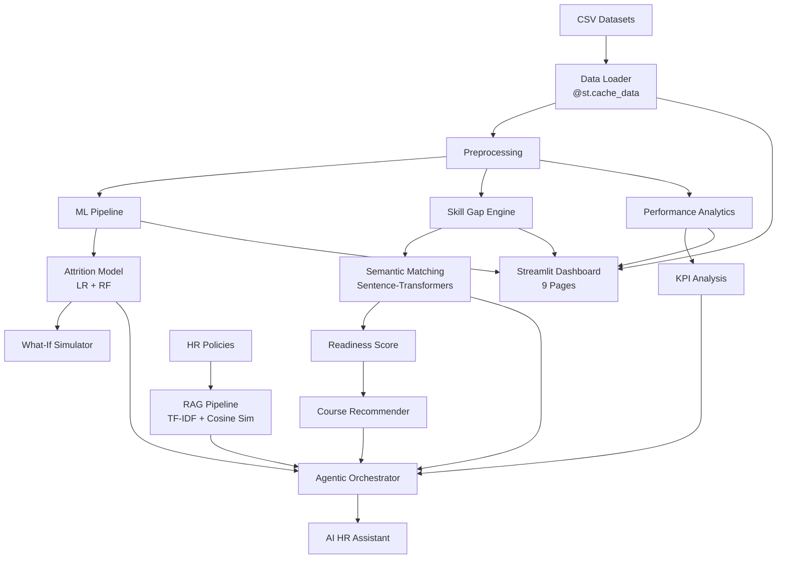

# 🧠 Agentic HRMS — Workforce Intelligence Platform

An AI-powered HR workforce intelligence platform that demonstrates end-to-end employee analytics, attrition prediction, skill-gap analysis, career readiness assessment, personalized learning recommendations, and intelligent HR decision support.


---

## 📋 Table of Contents

1. [Project Overview](#project-overview)
2. [Problem Statement](#problem-statement)
3. [Solution](#solution)
4. [Features](#features)
5. [Dataset Description](#dataset-description)
6. [Architecture](#architecture)
7. [ML Models](#ml-models)
8. [Skill Gap Method](#skill-gap-method)
9. [Recommendation System](#recommendation-system)
10. [RAG Pipeline](#rag-pipeline)
11. [Agentic Workflow](#agentic-workflow)
12. [Interactivity & Live Mode](#interactivity--live-mode)
13. [Technology Stack](#technology-stack)
14. [How to Run](#how-to-run)
15. [Project Limitations](#project-limitations)
16. [Future Improvements](#future-improvements)

---

## Project Overview

This platform integrates multiple AI/ML capabilities into a single, interactive Streamlit dashboard that serves as a comprehensive workforce intelligence tool. It processes 7 real datasets to deliver actionable HR insights.

### Workflow

```
Employee Data → Analysis → Prediction → Skill Gap → Career Readiness → Recommendations → HR Decision Support
```

---

## Problem Statement

Modern HR departments face challenges in:
- Predicting employee attrition before it happens
- Understanding skill gaps across the organization
- Planning workforce development and reskilling
- Making data-driven hiring vs. reskilling decisions
- Providing personalized career development guidance

---

## Solution

A unified platform that combines:
- **Descriptive Analytics** — KPIs, distributions, trends
- **Predictive Analytics** — ML-based attrition prediction with what-if simulation
- **Prescriptive Analytics** — Skill gap analysis, course recommendations, hire vs reskill planning
- **Conversational AI** — RAG-powered HR assistant with visible agentic workflow

---

## Features

| Page | Key Features |
|------|-------------|
| Executive Dashboard | Global filters, KPI cards with deltas, 6+ interactive Plotly charts, Live Mode toggle |
| Employee Intelligence | Searchable employee selector, detailed profile cards, visual indicators |
| Attrition Prediction | Dual ML models, confusion matrix, ROC curve, what-if simulator with sliders |
| Performance Analytics | Department analysis, KPI correlations, performance classification |
| Skill Gap & Career Readiness | Semantic skill matching, readiness gauge, instant recompute on role change |
| Learning Recommendations | Personalized learning paths, course catalog, certification suggestions |
| Workforce Intelligence | Skill demand analysis, technology trends, hire vs reskill with interactive threshold |
| AI HR Assistant | Chat interface, streaming responses, visible reasoning trace, tool-based routing |
| About | Architecture overview, methodology, dataset info, status indicators |

---

## Dataset Description

| Dataset | Rows | Columns | Purpose |
|---------|------|---------|---------|
| `Cleaned_HR_Data_Analysis.csv` | 2,845 | 28 | Employee demographics, engagement, satisfaction, training |
| `employee_attrition.csv` | 1,470 | 35 | Attrition prediction ML training (target: `Attrition`) |
| `Employee_Performance_Dataset.csv` | 5,000 | 13 | KPI scores, attendance, task completion, peer/manager ratings |
| `employee_performance_pro.csv` | 500 | 24 | Extended profiles with salary, overtime, attrition risk |
| `occupation_data.csv` | 1,016 | 3 | O*NET occupations with descriptions |
| `essential_skills.csv` | 18,200 | 15 | Essential skills per occupation (importance/level ratings) |
| `software_skills.csv` | 31,821 | 7 | Technology/software skills per occupation |

---

## Architecture



---

## ML Models

### Attrition Prediction
- **Algorithms:** Logistic Regression + Random Forest
- **Target:** `Attrition` column (Yes/No) — 16.1% positive rate
- **Class Balancing:** `class_weight='balanced'`
- **Evaluation:** Accuracy, Precision, Recall, F1 (selection metric), ROC-AUC
- **Selection:** Best model chosen by F1 score (handles class imbalance better)
- **Features:** 30 features after dropping constants (`EmployeeCount`, `StandardHours`, `Over18`)

---

## Skill Gap Method

1. **Role Mapping:** Employee job role → closest O*NET occupation (via fuzzy + rule-based matching)
2. **Skill Extraction:** Essential skills + software/technology skills from O*NET data
3. **Semantic Matching:** `sentence-transformers/all-MiniLM-L6-v2` for cosine similarity, with `SequenceMatcher` fuzzy fallback
4. **Readiness Score:** `matched_skills / total_required_skills × 100`

> ⚠️ Employee current skills are **inferred** from their job role, not from actual verified skill assessments.

---

## Recommendation System

- **Course Catalog:** 30 internal courses covering Data & Analytics, Software Engineering, Business, Core Skills, and Technology
- **Matching:** Skill gap → most relevant course by keyword/semantic similarity
- **Learning Path:** Ordered by difficulty (Beginner → Intermediate → Advanced) and relevance
- **Certifications:** Mapped suggestions for industry-recognized certifications

---

## RAG Pipeline

```
Policy Documents → Section-based Chunking → TF-IDF Vectorization → Cosine Similarity Retrieval → Formatted Response
```

- **Documents:** 5 sample HR policies (Leave, Training, Promotion, WFH, Employee Handbook)
- **No external LLM required** — retrieval-based answers only
- **Clear source attribution** in responses

---

## Agentic Workflow

A lightweight orchestrator that routes user queries to appropriate tools:

| Tool | Function |
|------|----------|
| `get_employee_profile` | Retrieve employee information |
| `predict_attrition` | Get attrition risk data |
| `get_required_skills` | Extract skills for target occupation |
| `calculate_skill_gap` | Compare current vs required skills |
| `calculate_readiness` | Compute career readiness score |
| `recommend_courses` | Generate course recommendations |
| `search_hr_policy` | Search policy documents |
| `get_performance_info` | Retrieve performance data |
| `get_workforce_stats` | Get organization statistics |

The orchestrator uses keyword-based intent detection and shows which tools were invoked in an expandable "Reasoning Trace" panel.

---

## Interactivity & Live Mode

### What's genuinely interactive:
- **Global Filters:** Department, Business Unit, Job Role, Status — all KPIs and charts recompute instantly
- **What-If Simulator:** Sliders adjust attrition prediction in real-time
- **Skill Gap Recompute:** Changing target occupation instantly recalculates readiness
- **Hire vs Reskill:** Threshold slider updates workforce planning numbers live

### What's simulated:
- **Live Mode:** Small bounded perturbation of displayed metrics to demonstrate a monitoring feel
- **Streaming Responses:** Typing-effect animation for assistant responses (no real LLM streaming)

Both are clearly labeled in the UI.

---

## Technology Stack

| Component | Technology |
|-----------|-----------|
| Frontend/Dashboard | Streamlit |
| Visualization | Plotly |
| Machine Learning | scikit-learn |
| NLP/Embeddings | Sentence-Transformers |
| Data Processing | pandas, NumPy |
| RAG | TF-IDF + Cosine Similarity |
| Model Persistence | joblib |

---

## How to Run

```bash
# 1. Navigate to the project directory
cd Capstone

# 2. Install dependencies
pip install -r requirements.txt

# 3. Run the application
streamlit run app.py

# 4. Open browser at http://localhost:8501
```

---

## Project Limitations

1. Employee skills are **inferred from job roles**, not actual verified skill data
2. Attrition model is trained on a specific IBM-style dataset — may not generalize to all organizations
3. HR policies are **sample documents** for RAG demonstration, not real company policies
4. Live Mode shows **simulated** metric perturbation, not real-time HR data feeds
5. The AI assistant uses rule-based routing, not a full LLM agent
6. Course recommendations are from a generated internal catalog, not a real LMS
7. Hire vs Reskill analysis uses prototype-level estimation

---

## Future Improvements

- [ ] Integration with real HRIS/LMS systems for live data
- [ ] Full LLM integration (GPT-4, Gemini) for natural language understanding
- [ ] Actual employee skill assessments and verified skill profiles
- [ ] Time-series analysis for workforce trends
- [ ] More sophisticated reskilling cost/benefit modeling
- [ ] Multi-language support
- [ ] Role-based access control (RBAC)
- [ ] Export/reporting functionality (PDF, Excel)
- [ ] A/B testing for recommendation effectiveness
- [ ] Integration with job posting APIs for real-time demand signals
